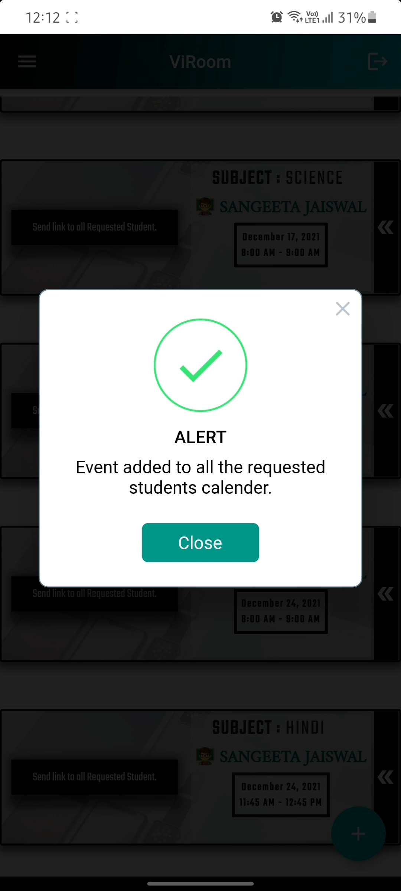

# ViRoom App

ViRoom is an android app build using Flutter, which integrates google meet, with the help of Calendar API.


## Getting Started

ViRoom is an application which creates a platform, that help students & faculties to connect in this pandemic.

It is a tool that let faculties schedule a class online, that will be taken offline or remotely at particular
date & time. The tool helps faculty to set the maximum requirement of the students for an offline class,
and students on other side can request to join the class in-person or remotely. Showing a list of all the
requested students to the faculty, who can either allow or reject that particular student.

Faculty when created the class, will also add an event to his calendar on that date & time, and will generate a google
meet link so that the students who are rejected or were not able to request before the class got filled,
can join the class online, through the invitation mail send to their registered email.


### How To Use

#### Step 1:
Download or clone this repository.

#### Step 2:
Go to project root and execute the following command in console to get the required dependencies:
```
flutter pub get
```

#### Step 3:
Add your ANDROID_CLIENT_ID in:
```
lib/Secret_keys_secret.dart
```

#### Step 4:
To get more details to enable Calendar API & generate ANDROID_CLIENT_ID:

[Click Here](https://blog.codemagic.io/google-meet-events-in-flutter/)

If Android Client ID not generated, refer this:

> https://developers.google.com/identity/protocols/oauth2/native-app

#### Step 5:
Replace google-services.json, with your json file (make sure you added the
right package name in firebase) , which contains client Id, certificate_hash & Api key:
```
android/app/google-services.json
```

#### Tip:
> Make sure you download json file again after adding SHA key.

> Keep your Power Saving Mode off, as that might create problem in calendar access.

> Enable your Realtime Database, Cloud Firestore & Firebase Authentication.

> Getting problem in generating SHA key? use this command in Android Studio Terminal:

`keytool -list -v -keystore "%USERPROFILE%\.android\debug.keystore" -alias androiddebugkey -storepass android -keypass android`


### ViRoom Features:

 1. Schedule offline & online class.
 2. Integrate Google meet, with the help of calendar API.
 3. User Authentication
    - Letting students & faculties to sign up, by filling basic details.
    - Letting already existing users to login.
    - Taking Google access permission from users, to add, delete event from their calendar.
 4. Features for Faculties
    - Scheduling offline classes.
    - Entering all required details about the class.
    - Setting up a limit of maximum students allowed in an offline class.
    - Getting list of all the students requested to join the class.
    - Allowing or Rejecting students depending on their details (like:Vaccination Status).
    - Generating google meet link for the same class scheduled offline, so that the students rejected or were not able
    to request before class got filled can join it online.
    - Button to send google meet link to all the requested students, with an invitation email.
    - Letting them delete any class they want to, which will send cancellation mail to all the students requested
     & received invitation before. (Cancellation mail will only be sent if the faculty have send invitation mail
     before by click on send link button, if no invitation mail sent, then deletion of that class wont't send any cancellation email.)
    - Alerting faculties when students allowed, reach a limit.
 5. Features For Students
    - Requesting to Join class remotely.
    - Viewing their Status of every class (allowed, rejected or waiting).
    - Ability to change their details (vaccination status).
    - If class filled, sending request to join online.
    - Receiving an invite of the class to join online.

### Folder Structure
   Here is the core folder structure which flutter provides:
   ```
   flutter-app/
   |- android
   |- build
   |- ios
   |- lib
   |- test
   ```
   Here is the folder structure we have been using in this project:
   ```
   lib/
   |- authentication/
   |- calender_files/
   |- db/
   |- Screens/
   |- Secret_keys/
   |- widgets/
   |- constant.dart
   |- main.dart
   ```
### Authentication
   This directory contains all the files for user's authentication (in firebase):
   ```
   authentication/
   |- login.dart
   |- signUp.dart
   ```

### Calender_files
   All the files that are used to insert, modify or delete an event in the calendar are included in this directory:
   ```
   calender_files/
   |- calender_client.dart
   |- event_info.dart
   ```

### db
   Contain files used to store data in database (firestore):
   ```
   db/
   |- storage.dart
   |- user.dart
   ```

### Screens
   This directory includes all the screens in the App:
   ```
   Screens/
   |- Class_list
      |- schedulerList.dart
   |- Event_creation
      |- create_screen.dart
   |- SplashScreen
      |- splash_screen.dart
   |- UpdateForm.dart
   |- welcome_page.dart
   ```

 1. Class_list
    - Contain file that shows list of all the class added by faculties.
 2. Event_creation
    - Contain file to schedule offline & online class.
 3. SplashScreen
    - Splash screen of the App.
 4. UpdateForm
    - Updating the vaccination status details.
 5. welcome_page
    - First page of the app.


### Secret_keys
   ```
   Secret_keys/
   |- secret.dart
   ```

### widgets
   Contains the common widgets that are shared across multiple screens. For example, Button, TextField etc:
   ```
   widgets/
   |- color.dart
   |- drawer_inkWell.dart
   |- my_ListTile.dart
   |- my_TextField.dart
   |- myButton.dart
   ```

### App apk

   [Click Here](https://drive.google.com/file/d/1cmIfxBIuPXs5zm3uksUGLqeNzf3LDKVa/view?usp=sharing)


## ScreenShots


            
               
              


## Conclusion
  ViRoom is an advanced scheduler, a tool build for the students & faculties to manage classes, in this pandemic as well as in normal days.


